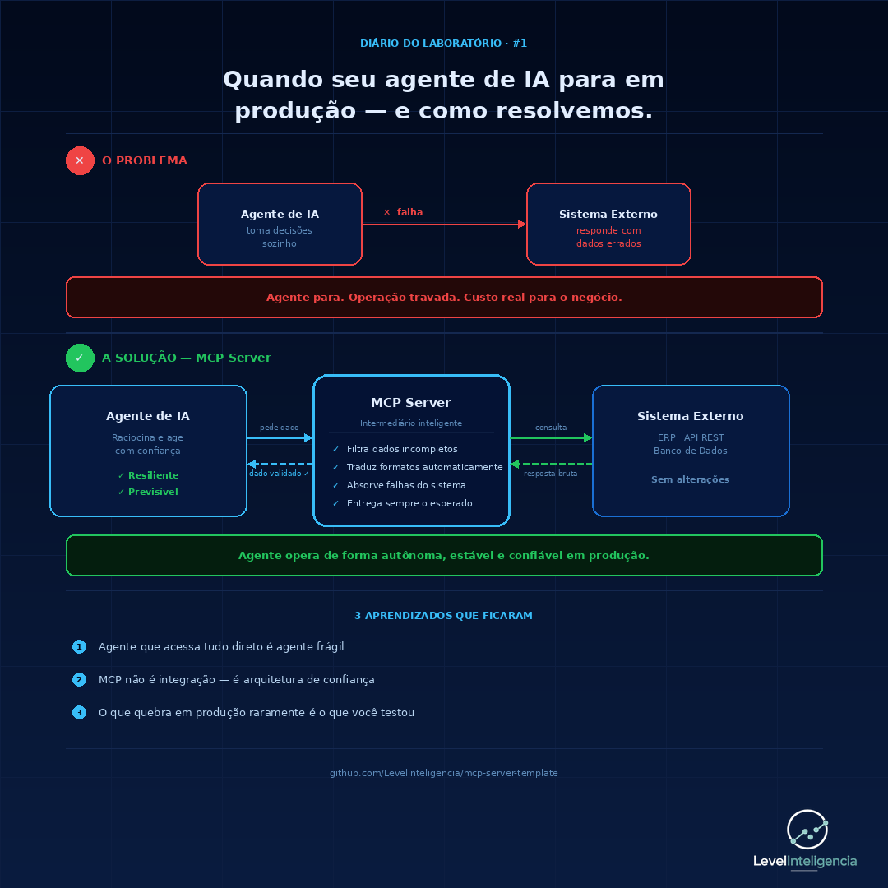

# MCP Server Template

> Template de arquitetura para integração de Agentes de IA com sistemas externos via Model Context Protocol (MCP).
> Desenvolvido por [LevelInteligencIA](https://github.com/Levelinteligencia)

---

## O problema que isso resolve

Agentes de IA que acessam sistemas externos diretamente são frágeis. Quando a API retorna dados incompletos, em formato inesperado ou simplesmente falha, o agente para, e num sistema autônomo, parar tem custo operacional real.

O MCP Server funciona como uma camada intermediária inteligente entre o agente e o mundo externo. O agente só recebe o que precisa, no formato que espera, sempre.



---

## Estrutura do projeto

```
mcp-server-template/
├── servidor.py                # Ponto de entrada do MCP Server
├── ferramentas/
│   ├── __init__.py
│   └── ferramenta_exemplo.py  # Exemplo de ferramenta exposta ao agente
├── agentes/
│   └── agente_exemplo.py      # Exemplo de agente consumindo o servidor
├── docs/
│   └── arquitetura.md         # Decisões arquiteturais
├── requirements.txt
└── .env.exemplo
```

---

## Decisões arquiteturais

### Por que MCP Server e não chamada direta?

| Abordagem | Vantagem | Risco |
|---|---|---|
| Agente chama API direto | Simples de implementar | Frágil, difícil de depurar, não escala |
| MCP Server intermediário | Resiliente, testável, desacoplado | Um componente a mais para manter |

A escolha pelo MCP Server foi motivada por três fatores:
1. **Resiliência**: o agente não quebra quando o sistema externo se comporta de forma inesperada
2. **Testabilidade**: é possível testar o servidor independente do agente
3. **Evolução**: trocar o sistema externo não exige mudança no agente

### Princípios aplicados

- **Separação de responsabilidades**: o agente raciocina, o MCP Server integra
- **Falha controlada**: erros são capturados, registrados e retornados de forma estruturada
- **Fonte única de verdade**: toda normalização de dados acontece no servidor, nunca no agente

---

## Como usar

### 1. Clone o repositório
```bash
git clone https://github.com/Levelinteligencia/mcp-server-template.git
cd mcp-server-template
```

### 2. Instale as dependências
```bash
pip install -r requirements.txt
```

### 3. Configure as variáveis de ambiente
```bash
cp .env.exemplo .env
# edite o .env com suas credenciais
```

### 4. Inicie o servidor
```bash
python servidor.py
```

---

## Tecnologias utilizadas

- **Python 3.11+**
- **MCP SDK** — Model Context Protocol
- **httpx** — chamadas HTTP assíncronas
- **python-dotenv** — gestão de variáveis de ambiente
- **loguru** — registro de logs estruturado

---

## Projetos que usam esta arquitetura

Esta arquitetura foi aplicada em produção em um ecossistema de agentes autônomos para automação de operações de varejo, incluindo:
- Agente de reativação de clientes inativos
- Agente de alertas de estoque parado
- Agente de disparos personalizados por datas comemorativas
- Agente de diagnóstico de cadastros

Todos integrados a ERP via API REST, orquestrados via GitHub Actions.

---

## Autor

**LevelInteligencIA** — Laboratório de Analytics, Engenharia de Dados e IA

[](https://www.linkedin.com/company/levelinteligencia)
